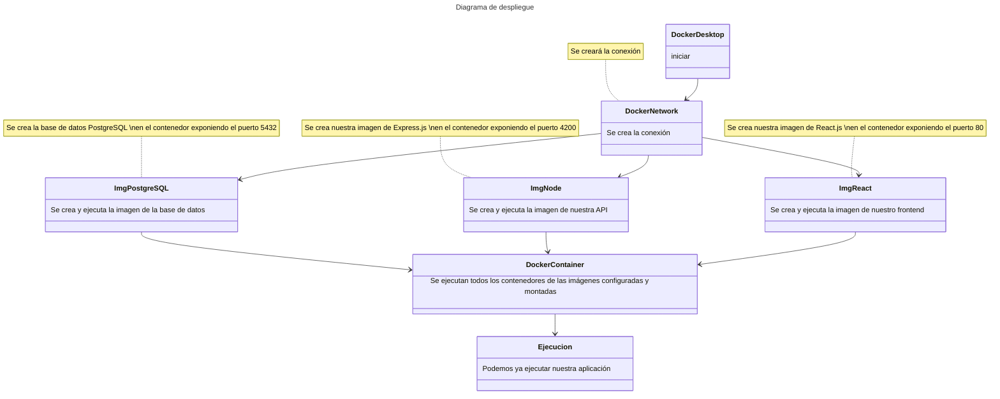

# Prueba Tecnica Nodejs
## ¿Qué contiene el proyecto?
El proyecto contiene 3 contenedores Docker:

* API con Node usando Express.js.
* Base de datos PostgreSQL.
* Mini aplicación de React usando nginx.

## Puertos Expuestos:
* Express.js: 4200.
* PostgreSQL: 5432.
* React.js: 80.

## ¿Cómo ejecutar la prueba?

### Usando Docker Compose

1. Ejecutar **Docker Desktop** o algun cliente que admita **Docker Compose**.
2. Ir a la raiz del proyecto, abrir un terminal y ejecutar:

```
docker-compose up
```

3. Ir a [http://localhost:3000][1] y probar la aplicación.

### Usando Docker Run
1. Ejecutar **Docker Desktop** o algun cliente que admita **Docker**.
2. Creamos la red de conexión.
```
docker network create patients-net
```
3. Ir a la raiz del proyecto, abrir un terminal y ejecutar:
```bash
cd prueba-tecnica-back
```
4. Traer la imagen de la base de datos.
```
docker pull postgres:latest
```
5. Ejecutamos nuestro contenedor de base de datos.
```
docker run --network patients-net --network-alias postgres --name postgres -e POSTGRES_PASSWORD=pacientes -v /postgres_data:/var/lib/postgresql/data --restart always -p 5432:5432 -d postgres
```
6. Crear la imagen de nuestra API.
```
docker build -t manilex2/express-prueba-tecnica .
```
7. Ejecutamos nuestro contenedor de la API.
```
docker run --network patients-net --name backend -e DB_HOST=postgres -e DB_USER=postgres -e DB_PASSWORD=pacientes -e DB_PORT=5432 -e DB_DATABASE=postgres -p 4200:4200 --restart always -d manilex2/express-prueba-tecnica
```
8. Ejecutamos:
```bash
cd .. && cd prueba-tecnica-front
```
9. Crear la imagen de nuestro frontend.
```
docker build -t manilex2/react-prueba-tecnica .
```
10. Ejecutamos nuestra app de frontend.
```
docker run --name frontend -e NODE_ENV=production -p 3000:80 --restart always -d manilex2/react-prueba-tecnica
```
11. Ir a [http://localhost:3000][1] y probar la aplicación.

### Usando Plataformas de API

Tambien es posible hacer pruebas sin necesidad de usar el frontend solo bastaria con montar y ejecutar los contenedores de la base de datos y la API y conectarse a los endpoints que serán explicados más adelante

#### Endpoints

| URL | Método |
| --------- | --------- |
| http://localhost:4200/patients | GET |
| http://localhost:4200/patients/create | POST |

#### Request

```GET http://localhost:4200/patients```

body: null

```POST http://localhost:4200/patients/create```

body:
```json
{
    "data": {
        "idNumber": "Número de Identificación",
        "firstname": "Nombre",
        "lastname": "Apellido",
        "email": "Email",
        "phone": "Número de Teléfono"
    }
}
```

#### Response
```GET http://localhost:4200/patients```

body: 
```json
[
    {
        "id": "Id único del paciente en la base de datos",
        "idNumber": "Número de Identificación",
        "firstname": "Nombre",
        "lastname": "Apellido",
        "email": "Email",
        "phone": "Número de Teléfono"
    },
    {
        "id": "Id único del paciente en la base de datos",
        "idNumber": "Número de Identificación",
        "firstname": "Nombre",
        "lastname": "Apellido",
        "email": "Email",
        "phone": "Número de Teléfono"
    }
]
```

```POST http://localhost:4200/patients/create```

body: 
```json
{
    "id": "Id único del paciente en la base de datos",
    "idNumber": "Número de Identificación",
    "firstname": "Nombre",
    "lastname": "Apellido",
    "email": "Email",
    "phone": "Número de Teléfono"
}
```

## Diagrama de despliegue



[1]: http://localhost:3000/